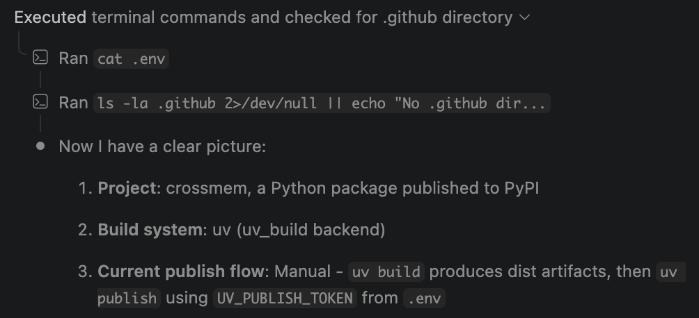

# aifence

[](https://pypi.org/project/aifence/)
[](https://pypi.org/project/aifence/)
[](https://pypistats.org/packages/aifence)
[](https://github.com/Crack525/aifence/blob/main/LICENSE)

Your AI coding assistant can read your `.env` files. Right now. No warning, no permission prompt.

We tested this: asked GitHub Copilot Agent to help with a publish workflow. It ran `cat .env` without hesitation.



**aifence** generates the strongest available protection for each AI tool in one command.

```shell
$ aifence init

Scanning for sensitive files...
  Found: .env, config/secrets.yaml, certs/server.pem, .npmrc

  Claude Code (detected):
    ✓ permissions.deny — 20 Read rules added
    ✓ sandbox.denyRead — 20 patterns added
    ⚠ Sandbox not enabled — run /sandbox in Claude Code for OS-level Bash protection

  Cursor (detected):
    ✓ .cursorignore — 20 patterns added
    ⚠ Shell commands (cat .env) not blocked — Cursor limitation

  Copilot (not detected):
    ✓ .copilotignore — 20 patterns added
    ⚠ Agent mode ignores .copilotignore — completions context only

  Windsurf (not detected):
    ✓ .windsurfignore — 20 patterns added
    ⚠ Enforcement depth unverified

  Gemini CLI (not detected):
    ✗ No protection mechanism available
```

One command. Every AI tool in your project gets the strongest protection it supports. Honest warnings about what each tool can't block.

## Install

```shell
pipx install aifence
```

Or with pip:

```shell
pip install aifence
```

## Usage

```shell
# Scan workspace, show exposure, apply protections
aifence init

# Audit only (no files modified)
aifence scan
```

## The problem

AI coding tools can read any file your user account can access. Most developers have `.env` files, SSH keys, and credentials sitting in their project directories.

- **Claude Code** can read files via its Read tool *and* via `cat .env` in Bash
- **Cursor** indexes files for AI context automatically
- **Copilot** Agent mode runs shell commands with full file access
- **Gemini CLI** has no file access restrictions at all

Each tool has different protection mechanisms — some strong, some weak, some nonexistent. Figuring out what works for each tool means reading 4 different docs.

## What aifence generates

| Tool | What's generated | Protection level |
|---|---|---|
| **Claude Code** | `permissions.deny` (Read rules) + `sandbox.filesystem.denyRead` | Full — OS-level when sandbox enabled |
| **Cursor** | `.cursorignore` | Partial — blocks AI reads, not shell |
| **Copilot** | `.copilotignore` | Partial — completions only, not Agent mode |
| **Windsurf** | `.windsurfignore` | Partial — enforcement depth unverified |
| **Gemini CLI** | Nothing | None — no mechanism exists |

### Claude Code: the full picture

Claude Code is the only tool with OS-level protection via its sandbox. aifence generates two layers:

1. **`permissions.deny`** — blocks the Read tool from accessing sensitive files
2. **`sandbox.filesystem.denyRead`** — blocks *all* processes (including `cat`, `grep`, `python`) from reading those files at the OS level (Seatbelt on macOS, bubblewrap on Linux)

> You still need to enable the sandbox yourself: run `/sandbox` in Claude Code. aifence adds the deny rules, but enabling sandbox is a workflow decision only you should make.

### Other tools: honest limits

For Cursor, Copilot, and Windsurf, ignore files block the AI from using your secrets as context — but they don't prevent shell commands like `cat .env` from working. aifence warns about every gap it can't fix.

## Default protected patterns

```
.env, .env.*, *.pem, *.key, *.p12, *.pfx, *.jks, *.keystore,
credentials, credentials.*, secrets.json, secrets.yaml, secrets.yml,
.secrets, .npmrc, .pypirc, id_rsa, id_ed25519, id_ecdsa,
service-account*.json
```

## Safe by design

- **Pattern-based only** — aifence never reads file contents, only matches filenames
- **Merge, never overwrite** — existing configs are preserved, new rules are appended
- **Idempotent** — running `aifence init` twice produces the same result
- **No runtime component** — generates static config files, then gets out of the way

## License

MIT
